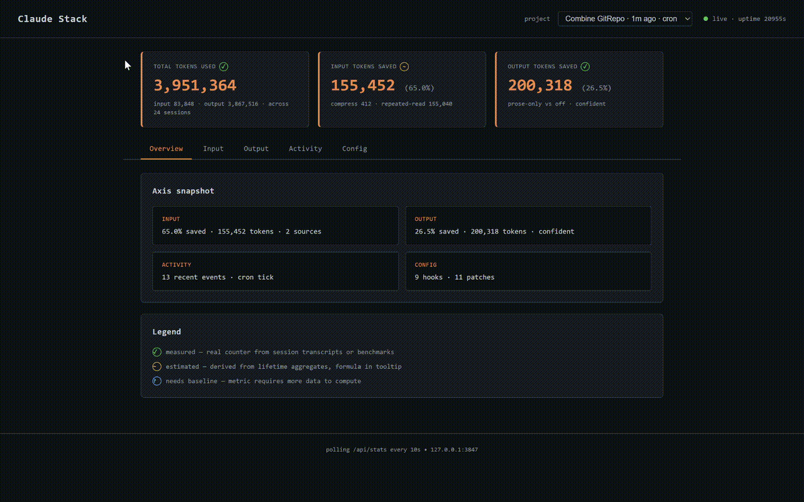

# claudecode-token-optimizer

**A Claude Code efficiency stack. ~54% fewer input tokens. ~22% shorter prose responses. Measured.**

[](./LICENSE-ATTRIBUTION.md)
[](https://nodejs.org/)
[](#prerequisites)



---

## What this is

A local, zero-telemetry stack that makes Claude Code sessions cheaper and faster without changing how you work. It plugs into Claude Code via hooks, skills, and a local dashboard. Everything runs on your machine; nothing phones home.

It combines three independent pieces and a dashboard to observe them:

| Component | What it does | Measured effect |
|---|---|---|
| **`caveman`** | Injects output-compression rules per session. Strips articles, filler, pleasantries, and hedging from prose. **Code, errors, commits, PRs unchanged.** | ~22% fewer output prose tokens (~35% when isolated from tool-use tokens — n=8 full + 9 off sessions) |
| **`OpenWolf`** | Hooks block repeated reads of the same file per session; cached anatomy descriptions inject instead. Per-project memory + buglog. | ~54% fewer input tokens (n=17 sessions) |
| **`caveman-compress`** | On-demand skill that compresses markdown memory files in place. | 30–50% file-size reduction on typical CLAUDE.md / memory.md |
| **Dashboard** | Local Express server on `http://127.0.0.1:3847`. Hero KPI strip + 5-tab drilldown (sessions, caveman, OpenWolf, benchmarks, config), per-project switcher, cron host. | Observability — not itself a token-saver |

Measurements above are from this project's own Claude Code sessions and are reproducible on your own data once you install.

---

## Install — paste into Claude Code

<!--
  DRIFT GUARDRAIL: the install prompt below is duplicated in
  INSTALL_PROMPT.md. Keep both copies identical. If you change one,
  update the other in the same PR.
-->

The fastest path: paste this into any Claude Code session and let Claude do the install.

```text
Install claudecode-token-optimizer: set D=~/claudecode-token-optimizer; if [ -d "$D/.git" ] run `cd "$D" && git pull`, elif [ -d "$D" ] run `mv "$D" "${D}.backup.$(date +%s)" && git clone --depth 1 https://github.com/JPauravS/claudecode-token-optimizer.git "$D" && cd "$D"`, else run `git clone --depth 1 https://github.com/JPauravS/claudecode-token-optimizer.git "$D" && cd "$D"`; then `npm run setup -- --yes --non-interactive` and `npm run doctor` (last stdout line has a `DOCTOR_RESULT:` sentinel — `{"pass":true}` = green; or pipe `--json` for pure JSON). If green, ask me if I want the dashboard to auto-start on every Claude Code session — if yes, run `node scripts/merge-settings.js --enable-autostart`. To view savings, run `npm run dashboard` in a new terminal and open http://127.0.0.1:3847. If install fails, run `npm run doctor`, copy its output plus the `dashboard/data/diagnostic-*.log` path, and open a GitHub issue at https://github.com/JPauravS/claudecode-token-optimizer/issues.
```

Claude will clone, install, verify, and report savings. That's the whole install.

### Prerequisites

Auto-checked by the installer. If any are missing, `npm run setup` exits with an `ERR_PREREQ:` line that Claude will see and resolve before retrying.

- Claude Code (already installed — that's how you're pasting this)
- Node ≥ 20
- git
- bash (Git Bash on Windows)

---

## Manual install (for auditors or CI)

```bash
git clone https://github.com/JPauravS/claudecode-token-optimizer.git
cd claudecode-token-optimizer
npm run setup              # add --verbose for full phase output
npm run doctor             # verify — look for DOCTOR_RESULT: {"pass":true}
npm run dashboard          # start dashboard at http://127.0.0.1:3847
```

Flags:

| Flag | Effect |
|---|---|
| `--yes` | Accept all interactive defaults (detected project/workspace paths) |
| `--non-interactive` | No prompts; exit on missing prereqs; auto-run doctor post-install (implied by `CI=1`) |
| `--verbose` | Stream full phase output to stdout (default: one line per phase) |
| `--reconfigure` | Re-prompt for `.wolf/` paths even if config exists |

See `TROUBLESHOOTING.md` for platform gotchas (Windows Git Bash, OneDrive-synced paths, corporate proxies).

---

## Slash commands (added globally to Claude Code)

- `/caveman off | on | lite | ultra` — toggle output compression mid-session
- `/openwolf status | scan | bug` — memory/state + project anatomy + buglog

---

## How it works (brief)

1. **Hooks.** At session start, the caveman `UserPromptSubmit` hook injects compression rules; OpenWolf hooks wrap `Read` / `Write` to dedupe repeated reads and inject cached file descriptions. At `Stop`, per-session token usage is recorded to `dashboard/data/sessions.json`.
2. **Skills.** `caveman` defines the compression contract; `caveman-compress` is an on-demand tool to shrink markdown memory files.
3. **Dashboard.** Node/Express server renders the local state and hosts the cron scheduler that runs `anatomy-rescan` (6h) and `memory-consolidation` (02:00 daily).
4. **Data stays local.** Dashboard binds `127.0.0.1` only. No telemetry, no analytics, no outbound traffic beyond `git clone` and `npm install` at setup.

---

## Uninstall

```bash
cd ~/claudecode-token-optimizer
bash teardown.sh
```

Restores `~/.claude/settings.json` from `.bak`, removes `node_modules`, and prompts to delete `.wolf/` directories (preserves by default in non-interactive mode). Run `npm run doctor` afterward to confirm clean state.

---

## Privacy + license

- **Network.** Dashboard binds `127.0.0.1` only — not LAN-exposed, not internet-exposed.
- **Telemetry.** None. No phone-home. No analytics. Every byte stays on your machine.
- **Data.** `dashboard/data/*.json` holds runtime state locally (gitignored). No outbound traffic beyond `git clone` + `npm install` during setup.
- **License.** MIT (our code, see `LICENSE`) + AGPL-3.0-or-later (vendored OpenWolf — see `LICENSE-ATTRIBUTION.md` for scope and obligations).

---

## Contributing + issues

- **Bugs / install failures:** https://github.com/JPauravS/claudecode-token-optimizer/issues — issue templates prompt for `npm run doctor` output + the `dashboard/data/diagnostic-*.log` path. Security issues: see `SECURITY.md`.
- **PRs welcome.** Read `CONTRIBUTING.md` before starting non-trivial work. Short version: small focused PRs, conventional commit prefixes, vendored subtrees (`hooks/openwolf/`, `hooks/caveman-*`, `skills/caveman*`) must be modified via `scripts/patches/*.patch.js` so changes survive the next `npm run fetch-*` sync.
- **Roadmap:** see `ROADMAP.md` for deferred features + promotion triggers.

---

## Credits

- [`JuliusBrussee/caveman`](https://github.com/JuliusBrussee/caveman) — MIT. Source of the prose-compression hook and skills.
- [`cytostack/openwolf`](https://github.com/cytostack/openwolf) — AGPL-3.0-or-later. Source of the memory/state and read-dedupe hooks.

See `LICENSE-ATTRIBUTION.md` for the full scope, pinned commits, file paths, local modifications, and license obligations.
